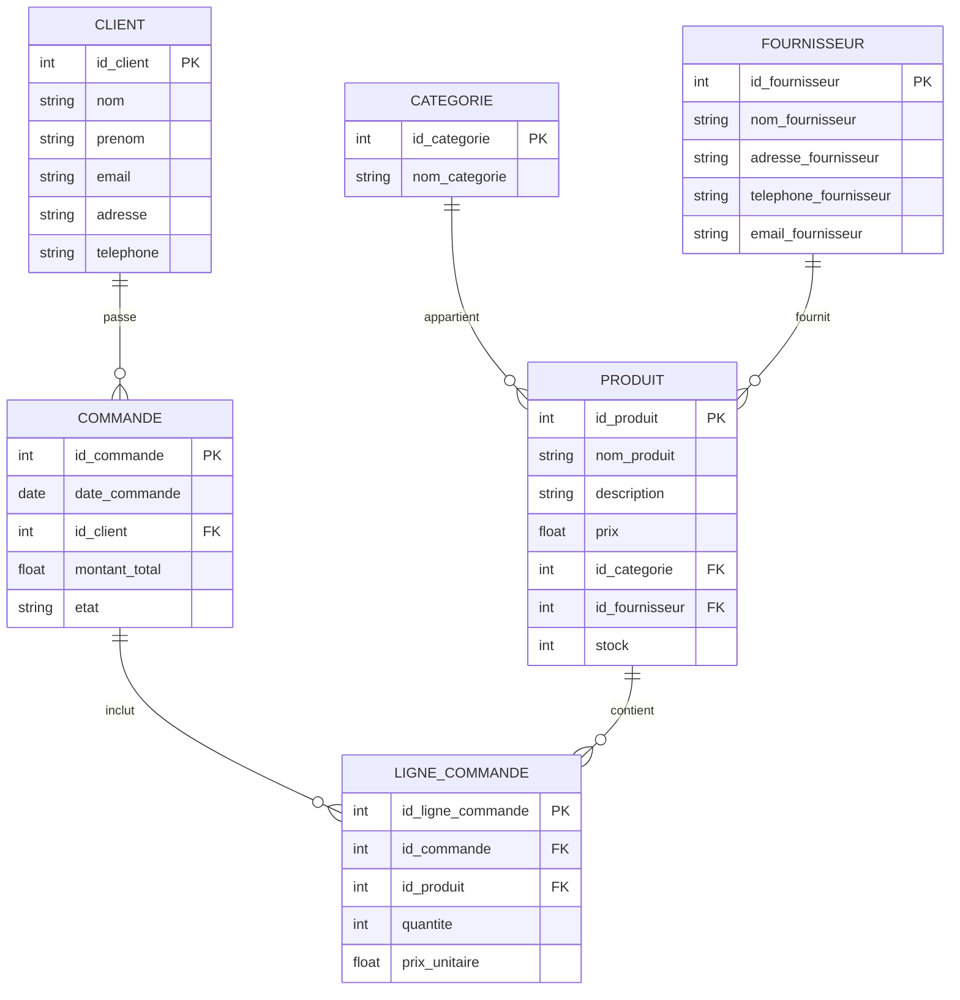

# Sql - Boutique En Ligne

Absolument ! Voici un exercice complet de SQL (SQLite) pour une boutique en ligne.

**1. Modèle Logique des Données (MLD) en ER Diagram**



**2. Création de la Base de Données et des Tables (À faire par vous)**

En utilisant un outil SQLite (comme DB Browser for SQLite, ou en ligne), créez une nouvelle base de données nommée `boutique_en_ligne.db` et exécutez les instructions SQL pour créer les tables basées sur le diagramme ER ci-dessus. Assurez-vous de définir les clés primaires et les clés étrangères correctement.

**3. Insertion de Données (Instructions et Données)**

Maintenant, insérez les données suivantes dans les tables que vous avez créées.

**Table `CLIENT`:**

|               |         |            |                            |                                     |                |
| ------------- | ------- | ---------- | -------------------------- | ----------------------------------- | -------------- |
| **id_client** | **nom** | **prenom** | **email**                  | **adresse**                         | **telephone**  |
| 1             | Dupont  | Jean       | jean.dupont@email.com      | 10 rue de la Paix, 75001 Paris      | 01 23 45 67 89 |
| 2             | Lefevre | Sophie     | sophie.lefevre@email.com | 5 avenue des Lilas, 69003 Lyon      | 06 98 76 54 32 |
| 3             | Martin  | Pierre     | pierre.martin@email.com | 12 boulevard Carnot, 31000 Toulouse | 05 61 01 02 03 |
| 4             | Dubois  | Alice      | alice.dubois@email.com | 3 rue du Château, 44000 Nantes      | 02 40 50 60 70 |

**Table `CATEGORIE`:**

|   |   |
|---|---|
|**id_categorie**|**nom_categorie**|
|1|Livres|
|2|Électronique|
|3|Vêtements|
|4|Maison|

**Table `PRODUIT`:**

|   |   |   |   |   |   |   |
|---|---|---|---|---|---|---|
|**id_produit**|**nom_produit**|**description**|**prix**|**id_categorie**|**stock**|**id_fournisseur**|
|1|Le Seigneur des Anneaux|Roman de J.R.R. Tolkien|25.50|1|50|1|
|2|Smartphone dernier modèle|Écran OLED, 128Go de stockage, 5G|799.99|2|25|2|
|3|T-shirt en coton bio|Taille M, couleur bleu marine|19.90|3|100|3|
|4|Lampe de chevet design|Lumière LED, 3 intensités|45.00|4|30|2|
|5|Les Misérables|Roman de Victor Hugo|18.75|1|75|1|
|6|Casque audio sans fil|Bluetooth, réduction de bruit active|149.00|2|40|2|
|7|Jean slim fit|Taille 32, couleur noir|59.95|3|60|3|

**Table `FOURNISSEUR`:**

|   |   |   |   |   |
|---|---|---|---|---|
|**id_fournisseur**|**nom_fournisseur**|**adresse_fournisseur**|**telephone_fournisseur**|**email_fournisseur**|
|1|Editions XYZ|15 rue des Livres, 75005 Paris|01 44 44 44 44|contact@editionsxyz.com|
|2|TechPlus SA|20 avenue de la Tech, 69100 Villeurbanne|04 78 88 88 88|info@techplus.com|
|3|Mode & Cie|8 rue des Textiles, 59000 Lille|03 20 30 40 50|contact@modeetcie.com|

**Table `COMMANDE`:**

|   |   |   |   |   |
|---|---|---|---|---|
|**id_commande**|**date_commande**|**id_client**|**montant_total**|**etat**|
|1|2025-04-01|1|102.00|Livrée|
|2|2025-04-03|2|819.89|En cours|
|3|2025-04-05|1|39.80|Préparée|
|4|2025-04-07|3|149.00|Livrée|

**Table `LIGNE_COMMANDE`:**

|   |   |   |   |   |
|---|---|---|---|---|
|**id_ligne_commande**|**id_commande**|**id_produit**|**quantite**|**prix_unitaire**|
|1|1|1|2|25.50|
|2|1|3|3|16.99|
|3|2|2|1|799.99|
|4|3|3|2|19.90|
|5|4|6|1|149.00|

<details>
<summary>Requêtes d'insertion de données</summary>

```sql
-- Insertion de données pour la table CLIENT
INSERT INTO CLIENT (id_client, nom, prenom, email, adresse, telephone) VALUES
(1, 'Dupont', 'Jean', 'jean.dupont@email.com', '10 rue de la Paix, 75001 Paris', '01 23 45 67 89'),
(2, 'Lefevre', 'Sophie', 'sophie.lefevre@email.com', '5 avenue des Lilas, 69003 Lyon', '06 98 76 54 32'),
(3, 'Martin', 'Pierre', 'pierre.martin@email.com', '12 boulevard Carnot, 31000 Toulouse', '05 61 01 02 03'),
(4, 'Dubois', 'Alice', 'alice.dubois@email.com', '3 rue du Château, 44000 Nantes', '02 40 50 60 70');

-- Insertion de données pour la table CATEGORIE
INSERT INTO CATEGORIE (id_categorie, nom_categorie) VALUES
(1, 'Livres'),
(2, 'Électronique'),
(3, 'Vêtements'),
(4, 'Maison');

-- Insertion de données pour la table PRODUIT
INSERT INTO PRODUIT (id_produit, nom_produit, description, prix, id_categorie, stock, id_fournisseur) VALUES
(1, 'Le Seigneur des Anneaux', 'Roman de J.R.R. Tolkien', 25.50, 1, 50, 1),
(2, 'Smartphone dernier modèle', 'Écran OLED, 128Go de stockage, 5G', 799.99, 2, 25, 2),
(3, 'T-shirt en coton bio', 'Taille M, couleur bleu marine', 19.90, 3, 100, 3),
(4, 'Lampe de chevet design', 'Lumière LED, 3 intensités', 45.00, 4, 30, 2),
(5, 'Les Misérables', 'Roman de Victor Hugo', 18.75, 1, 75, 1),
(6, 'Casque audio sans fil', 'Bluetooth, réduction de bruit active', 149.00, 2, 40, 2),
(7, 'Jean slim fit', 'Taille 32, couleur noir', 59.95, 3, 60, 3);

-- Insertion de données pour la table FOURNISSEUR
INSERT INTO FOURNISSEUR (id_fournisseur, nom_fournisseur, adresse_fournisseur, telephone_fournisseur, email_fournisseur) VALUES
(1, 'Editions XYZ', '15 rue des Livres, 75005 Paris', '01 44 44 44 44', 'contact@editionsxyz.com'),
(2, 'TechPlus SA', '20 avenue de la Tech, 69100 Villeurbanne', '04 78 88 88 88', 'info@techplus.com'),
(3, 'Mode & Cie', '8 rue des Textiles, 59000 Lille', '03 20 30 40 50', 'contact@modeetcie.com');

-- Insertion de données pour la table COMMANDE
INSERT INTO COMMANDE (id_commande, date_commande, id_client, montant_total, etat) VALUES
(1, '2025-04-01', 1, 102.00, 'Livrée'),
(2, '2025-04-03', 2, 819.89, 'En cours'),
(3, '2025-04-05', 1, 39.80, 'Préparée'),
(4, '2025-04-07', 3, 149.00, 'Livrée');

-- Insertion de données pour la table LIGNE_COMMANDE
INSERT INTO LIGNE_COMMANDE (id_ligne_commande, id_commande, id_produit, quantite, prix_unitaire) VALUES
(1, 1, 1, 2, 25.50),
(2, 1, 3, 3, 16.99),
(3, 2, 2, 1, 799.99),
(4, 3, 3, 2, 19.90),
(5, 4, 6, 1, 149.00);
```

</details>

**4. Requêtes SQL (Beaucoup !) (À faire par vous)**

Voici une longue liste de requêtes SQL que vous devez essayer d'écrire et d'exécuter sur votre base de données.

**Requêtes Simples (SELECT, FROM, WHERE):**

1. Affichez tous les clients.
2. Affichez les noms et prénoms des clients.
3. Affichez tous les produits.
4. Affichez les noms et prix des produits.
5. Affichez les produits dont le prix est supérieur à 50€.
6. Affichez les produits de la catégorie 'Livres'.
7. Affichez les commandes passées par le client dont l'id est 1.
8. Affichez les lignes de commande pour la commande dont l'id est 2.
9. Affichez les fournisseurs situés à '20 avenue de la Tech, 69100 Villeurbanne'.
10. Affichez les produits dont le stock est inférieur à 30.

**Requêtes avec JOIN (INNER JOIN):**

11. Affichez les noms des clients et les dates de leurs commandes.
12. Affichez les noms des produits et les noms de leurs catégories.
13. Affichez les noms des produits et les noms de leurs fournisseurs.
14. Affichez les détails des lignes de commande (id_commande, nom_produit, quantite, prix_unitaire).
15. Affichez les noms des clients et le nombre de commandes qu'ils ont passées.
16. Affichez les noms des catégories et le nombre de produits dans chaque catégorie.
17. Affichez les noms des fournisseurs et le nombre de produits qu'ils fournissent.
18. Affichez les commandes avec le nom du client qui les a passées et le montant total.
19. Affichez les lignes de commande avec le nom du produit et le nom de la commande associée.
20. Affichez les produits avec leur catégorie et le nom du fournisseur.

**Requêtes avec fonctions d'agrégation (COUNT, SUM, AVG, MIN, MAX) et GROUP BY, HAVING:**

21. Comptez le nombre total de clients.
22. Comptez le nombre total de produits.
23. Comptez le nombre de commandes.
24. Calculez le montant total de toutes les commandes.
25. Calculez le prix moyen de tous les produits.
26. Affichez le prix le plus élevé et le prix le moins élevé des produits.
27. Comptez le nombre de produits par catégorie.
28. Calculez le montant total des commandes par client.
29. Affichez les clients qui ont passé plus d'une commande.
30. Affichez les catégories ayant plus de 2 produits.
31. Calculez le montant moyen des commandes livrées.
32. Trouvez le client qui a dépensé le plus d'argent.
33. Trouvez la catégorie de produit la plus chère en moyenne.

**Requêtes avec LEFT JOIN, RIGHT JOIN, FULL OUTER JOIN:**

34. Affichez tous les clients et leurs commandes (même ceux qui n'ont pas passé de commande).
35. Affichez toutes les commandes et les clients qui les ont passées (même s'il y a des commandes sans client - peu probable dans ce modèle).
36. Affichez tous les produits et leurs catégories (même les produits sans catégorie - peu probable).
37. Affichez toutes les catégories et les produits associés (même les catégories sans produits).
38. Affichez tous les fournisseurs et les produits qu'ils fournissent (même les fournisseurs sans produits et les produits sans fournisseur).

**Requêtes avec sous-requêtes:**

39. Affichez les produits dont le prix est supérieur au prix moyen de tous les produits.
40. Affichez les clients qui ont passé au moins une commande dont le montant total est supérieur à 100€.
41. Affichez les produits de la catégorie ayant le plus grand nombre de produits.
42. Affichez les clients qui ont commandé le produit le plus cher.
43. Affichez les commandes contenant un produit de la catégorie 'Électronique'.

**Requêtes de modification de données (UPDATE, DELETE):**

44. Augmentez de 10% le prix de tous les produits de la catégorie 'Livres'.
45. Mettez à jour le stock du produit 'Smartphone dernier modèle' à 30.
46. Changez l'état de la commande dont l'id est 2 à 'Expédiée'.
47. Supprimez le client dont l'id est 4. (Attention aux contraintes de clés étrangères !)
48. Supprimez toutes les lignes de commande pour la commande dont l'id est 3.
49. Réduisez le stock de tous les produits de 5 unités.

**Requêtes avancées (si pertinent pour SQLite):**

50. Créez une vue qui affiche le nom du client et le montant total de ses commandes.
51. Sélectionnez toutes les informations de cette vue.
